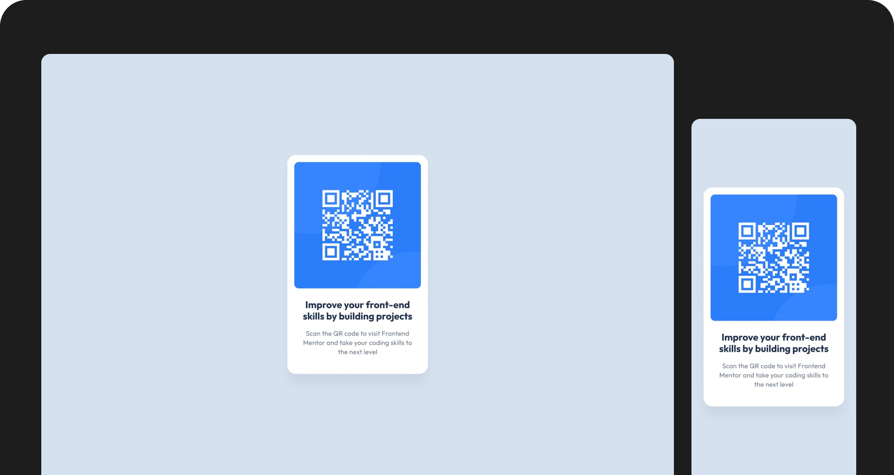

# Frontend Mentor - QR code component solution

This is a solution to the [QR code component challenge on Frontend Mentor](https://www.frontendmentor.io/challenges/qr-code-component-iux_sIO_H). Frontend Mentor challenges help you improve your coding skills by building realistic projects. 

## Screenshot

### Links

- Solution URL: [Live Site](https://mateusdmc.github.io/fm-qr-code-component/)

## My process

### Built with

- Semantic HTML5
- Flexbox
- Mobile-first
- [Tailwind CSS](https://tailwindcss.com/) - CSS framework
